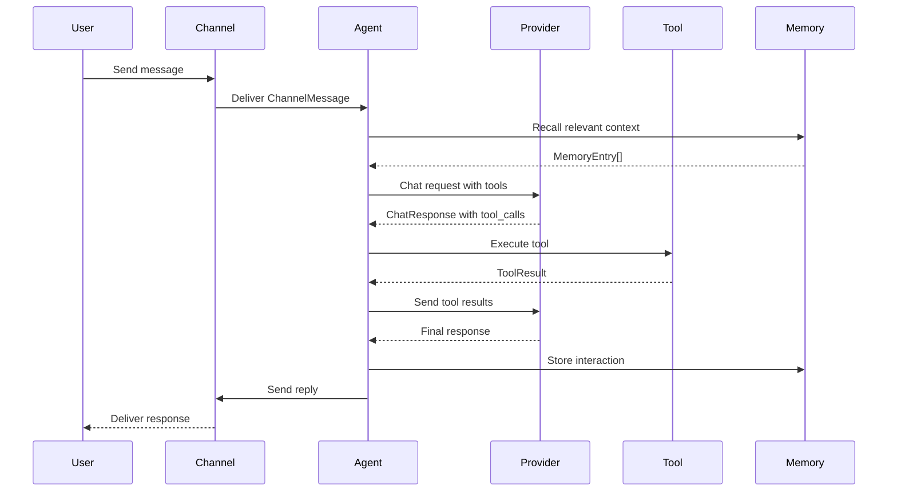

Corvus is built as a multi-layered, trait-driven agent framework designed for security, extensibility, and performance. This page provides a comprehensive view of the system architecture and how components interact.

## System Architecture

Corvus follows a layered architecture with clear separation of concerns:

```
┌─────────────────────────────────────────────────────────────┐
│                    Interfaces Layer                         │
│  CLI │ Desktop (Compose) │ Web Dashboard │ Mobile (iOS/Android)
└────────────────┬────────────────────────────────────────────┘
                 │
┌────────────────▼────────────────────────────────────────────┐
│                   Gateway & Service Layer                    │
│  • HTTP/WebSocket Gateway  • Pairing & Authentication       │
│  • Channel Integrations    • Webhook Handlers               │
└────────────────┬────────────────────────────────────────────┘
                 │
┌────────────────▼────────────────────────────────────────────┐
│                    Agent Core (Rust)                         │
│  • Agent Loop Orchestration  • Tool Execution               │
│  • LLM Provider Routing      • Memory Management            │
│  • Security Policy Engine    • Mission Planner              │
└─┬──────────┬─────────┬──────────┬────────────┬─────────────┘
  │          │         │          │            │
  │          │         │          │            │
  ▼          ▼         ▼          ▼            ▼
┌─────┐  ┌──────┐  ┌──────┐  ┌───────┐  ┌─────────┐
│ LLM │  │Tools │  │Memory│  │Channels│  │Runtime  │
│ API │  │(MCP) │  │ DB   │  │(Chat)  │  │Sandbox  │
└─────┘  └──────┘  └──────┘  └───────┘  └─────────┘
```

## Core Components

### 1. Agent Runtime

The **Agent Runtime** is the heart of Corvus, written in Rust for maximum performance and safety. It orchestrates the agent loop and manages the flow of execution.

**Key responsibilities:**
- Execute the agent reasoning loop
- Route requests to appropriate LLM providers
- Enforce security policies
- Manage conversation state and memory
- Handle tool invocations with sandboxing

**Location:** `clients/agent-runtime/src/agent/`

### 2. LLM Provider Layer

Corvus supports multiple LLM providers through a unified **Provider** trait interface.

**Supported providers:**
- OpenAI (GPT-4, GPT-3.5)
- Anthropic (Claude)
- Google Gemini
- Ollama (local models)
- OpenRouter (model aggregation)
- GitHub Copilot

**Key features:**
- Provider-agnostic tool calling (native or prompt-guided)
- Automatic failover and retry logic
- Request/response streaming
- Cost tracking and rate limiting

**Location:** `clients/agent-runtime/src/providers/`

### 3. Tool Execution System

Tools extend agent capabilities through the **Tool** trait. Each tool is a self-contained unit with:
- JSON schema for parameters
- Async execution handler
- Structured result format

**Built-in tools:**
- `shell` - Execute shell commands (with security policies)
- `file_read`/`file_write` - File system operations
- `git_operations` - Git commands
- `memory_store`/`memory_recall` - Memory operations
- `http_request` - HTTP client
- `browser` - Web automation
- `delegate` - Sub-agent delegation
- MCP (Model Context Protocol) tools

**Location:** `clients/agent-runtime/src/tools/`

### 4. Memory System

Corvus provides pluggable memory backends implementing the **Memory** trait:

**Backends:**
- **Markdown** - File-based storage for simplicity
- **SQLite** - Embedded SQL database
- **Neo4j** - Graph-based relationships
- **SurrealDB** - Multi-model database

**Memory categories:**
- `core` - Long-term facts and preferences
- `daily` - Session logs
- `conversation` - Chat context
- Custom categories

**Location:** `clients/agent-runtime/src/memory/`

### 5. Channel Integrations

Channels implement the **Channel** trait to connect Corvus with external messaging platforms.

**Supported channels:**
- WhatsApp (Meta Cloud API)
- Telegram
- Discord
- Slack
- Email
- CLI (stdin/stdout)

**Features:**
- Async message listening
- Typing indicators
- Draft message updates (streaming)
- Health checks

**Location:** `clients/agent-runtime/src/channels/`

### 6. Security Layer

Security is built into every layer of Corvus:

**Components:**
- **Policy Engine** - Defines what agents can do
- **Pairing Guard** - Gateway authentication
- **Sandbox** - Isolates dangerous operations
- **Audit Logger** - Records all actions
- **Secret Store** - Encrypted credential storage

**Location:** `clients/agent-runtime/src/security/`

See [Security Model](/security-model) for detailed information.

### 7. Runtime Adapters

RuntimeAdapters abstract platform differences through the **RuntimeAdapter** trait:

**Runtimes:**
- **Native** - Direct execution on host OS
- **Docker** - Containerized isolation
- **WASM** *(planned)* - WebAssembly sandboxing

**Location:** `clients/agent-runtime/src/runtime/`

See [Runtime Model](/runtime-model) for detailed information.

## Data Flow

### Typical Request Flow



### Agent Loop Execution

1. **Message Arrival** - Channel receives message and routes to agent
2. **Context Loading** - Agent recalls relevant memories
3. **LLM Invocation** - Provider generates response with optional tool calls
4. **Tool Execution** - Tools run in sandboxed environment
5. **Result Processing** - Tool results fed back to LLM
6. **Response Generation** - Final answer synthesized
7. **Memory Storage** - Interaction logged for future recall
8. **Reply Delivery** - Response sent back through channel

## Extension Points

Corvus is designed for extensibility through its trait-based architecture:

<CardGroup cols={2}>
  <Card title="Provider Trait" icon="brain" href="/trait-system#provider-trait">
    Add support for new LLM providers
  </Card>
  <Card title="Tool Trait" icon="wrench" href="/trait-system#tool-trait">
    Create custom agent capabilities
  </Card>
  <Card title="Channel Trait" icon="message" href="/trait-system#channel-trait">
    Integrate new messaging platforms
  </Card>
  <Card title="Memory Trait" icon="database" href="/trait-system#memory-trait">
    Implement custom persistence backends
  </Card>
  <Card title="RuntimeAdapter Trait" icon="server" href="/trait-system#runtimeadapter-trait">
    Support new execution environments
  </Card>
  <Card title="Observer Trait" icon="chart-line" href="/trait-system#observer-trait">
    Add observability and monitoring
  </Card>
</CardGroup>

## Project Structure

The Corvus monorepo is organized for clarity and modularity:

```
corvus/
├── clients/
│   ├── agent-runtime/     # Rust agent core (this doc)
│   ├── composeApp/        # Kotlin Multiplatform UI
│   ├── androidApp/        # Android wrapper
│   ├── iosApp/            # iOS wrapper
│   └── web/               # Web dashboard + docs
├── modules/
│   └── agent-core-kmp/    # Shared KMP business logic
├── dev/                   # Local dev environment
├── gradle/                # Build configuration
└── Makefile               # Standard dev commands
```

## Configuration System

Corvus uses a hierarchical configuration system:

1. **Default values** - Built into code
2. **Config file** - `corvus.toml` or `corvus.json`
3. **Environment variables** - Prefixed with `CORVUS_`
4. **CLI arguments** - Highest priority

**Key config sections:**
- `provider` - LLM configuration
- `security` - Policy and sandbox settings
- `runtime` - Execution environment
- `memory` - Persistence backend
- `gateway` - HTTP server settings
- `channels` - Messaging platform credentials

## Performance Characteristics

### Startup Time
- **Cold start:** &lt;100ms (native runtime)
- **With Docker:** ~2-3s (container spin-up)

### Memory Footprint
- **Baseline:** ~20-30MB (Rust binary)
- **With active session:** ~50-100MB
- **Docker limit:** Configurable (default 512MB)

### Throughput
- **Tool execution:** &lt;50ms overhead
- **Memory operations:** &lt;10ms (SQLite)
- **Channel latency:** &lt;100ms (webhook processing)

## Next Steps

<CardGroup cols={2}>
  <Card title="Trait System" icon="code" href="/trait-system">
    Learn about the trait-based architecture
  </Card>
  <Card title="Runtime Model" icon="server" href="/runtime-model">
    Understand execution environments
  </Card>
  <Card title="Security Model" icon="shield" href="/security-model">
    Explore security layers and policies
  </Card>
  <Card title="Building Your First Agent" icon="rocket" href="/quickstart">
    Get started with Corvus
  </Card>
</CardGroup>