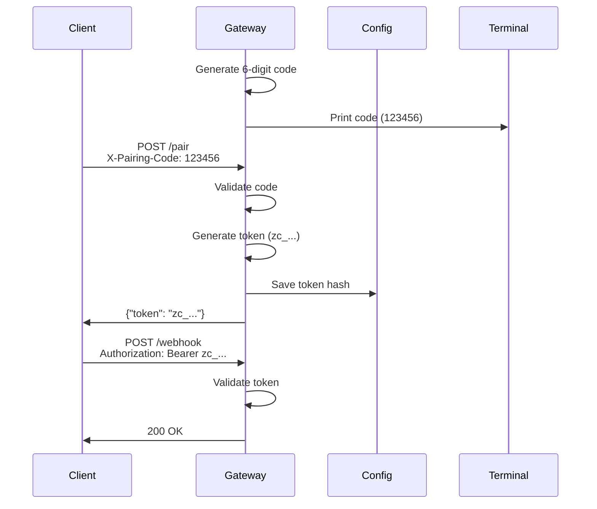

## Gateway Pairing Mechanism

The gateway requires **pairing** before accepting webhook requests. This prevents unauthorized access when the gateway is accidentally exposed.

### How Pairing Works

1. **Startup** — Gateway generates a 6-digit one-time pairing code
2. **Display** — Code is printed to the terminal (only visible to operator)
3. **Exchange** — Client sends code to `POST /pair` via `X-Pairing-Code` header
4. **Token Generation** — Server responds with a bearer token (256-bit entropy)
5. **Persistence** — Token hash is saved to `config.toml` for restarts



### Configuration

```toml
[gateway]
require_pairing = true  # default: true
allow_public_bind = false  # default: false
paired_tokens = []  # auto-populated on first pair
```

### Pairing Code Generation

The 6-digit code is generated using cryptographically secure randomness:

- **Source**: UUID v4 (backed by OS CSPRNG)
  - Linux: `/dev/urandom`
  - Windows: `BCryptGenRandom`
  - macOS: `SecRandomCopyBytes`
- **Entropy**: 256 bits from UUID
- **Range**: `000000` to `999999` (1 million possibilities)
- **Bias Elimination**: Rejection sampling for uniform distribution
- **One-Time**: Consumed after first successful pair

### Bearer Token Format

**Generation:**
```
zc_<64-char-hex>
```

- **Prefix**: `zc_` (Corvus token identifier)
- **Payload**: 32 random bytes (256-bit entropy) hex-encoded
- **Total Length**: 67 characters
- **Source**: `rand::rng()` OS CSPRNG

**Storage:**
- Tokens are hashed with SHA-256 before storage
- Config file stores 64-character hex hashes, not plaintext
- Prevents token exposure via config file access

### Brute Force Protection

**Attempt Limiting:**
- Maximum 5 failed pairing attempts
- 5-minute lockout after max attempts
- Lockout timer returns remaining seconds

```bash
# After 5 failed attempts:
curl -H "X-Pairing-Code: wrong" http://127.0.0.1:8080/pair
# {"error": "Too many failed attempts. Try again in 298s.", "retry_after": 298}
```

**Rate Limiting:**
- Per-client rate limiting on `/pair` endpoint
- Client identified by IP + headers
- Prevents distributed brute force attacks

**Constant-Time Comparison:**
- Token and code comparison uses `subtle::ConstantTimeEq`
- Prevents timing attacks
- No early return on mismatch

## Bearer Token Authentication

All authenticated endpoints require a bearer token in the `Authorization` header.

### Protected Endpoints

**`POST /webhook`**
```bash
curl -X POST http://127.0.0.1:8080/webhook \
  -H "Authorization: Bearer zc_<your-token>" \
  -H "Content-Type: application/json" \
  -d '{"message": "Hello, Corvus!"}'
```

**Admin endpoints** (if enabled):
- `GET /admin/config`
- `GET /admin/identity`
- `PATCH /admin/identity`

### Public Endpoints

**`GET /health`** — Always public, no auth required
```bash
curl http://127.0.0.1:8080/health
# {"status": "ok", "uptime_seconds": 123}
```

**WhatsApp webhook verification** — Meta webhook challenge
```bash
# Meta sends verification request
GET /whatsapp?hub.mode=subscribe&hub.verify_token=<your-token>&hub.challenge=<challenge>
```

### Token Validation

When a request arrives:

1. **Extract token** from `Authorization: Bearer <token>` header
2. **Hash token** with SHA-256
3. **Compare hash** against stored hashes (constant-time)
4. **Allow or deny** request based on match

### Token Lifecycle

**Creation:**
- Generated on first successful pairing
- Displayed once to client
- Never shown again (hash stored)

**Storage:**
- Saved to `config.toml` as SHA-256 hash
- Survives gateway restarts
- Multiple tokens supported

**Revocation:**
- Edit `config.toml` and remove token hash
- Restart gateway to apply changes
- Future: `corvus gateway unpair` command

## Public Bind Restrictions

The gateway **refuses to bind to public addresses** without explicit configuration or an active tunnel.

### Default Behavior

```bash
# Safe: binds to localhost only
corvus gateway
# Listening on 127.0.0.1:8080
```

**Blocked by default:**
- `0.0.0.0` (all interfaces)
- Public IP addresses
- Non-localhost hostnames

**Allowed by default:**
- `127.0.0.1` (IPv4 localhost)
- `localhost` (hostname)
- `::1` (IPv6 localhost)
- `[::1]` (IPv6 localhost with brackets)

### Public Bind Detection

The gateway checks the bind address before starting:

```rust
fn is_public_bind(host: &str) -> bool {
    !matches!(
        host,
        "127.0.0.1" | "localhost" | "::1" | "[::1]" | "0:0:0:0:0:0:0:1"
    )
}
```

If a public bind is detected:
1. Check if a tunnel is active
2. Check if `allow_public_bind = true`
3. Refuse to start if neither is true

### Allowing Public Bind

<Warning>
**Security Risk:** Only enable public bind if you understand the implications. Use a tunnel instead.
</Warning>

```toml
[gateway]
allow_public_bind = true  # NOT RECOMMENDED
```

This disables the public bind safety check. Use only for:
- Internal networks behind a firewall
- Development environments with additional security layers
- Situations where a tunnel is not feasible

### Random Port Mode

For additional security, use a random ephemeral port:

```bash
corvus gateway --port 0
# Listening on 127.0.0.1:54321 (random port)
```

Benefits:
- Port scanners won't find a known port
- Reduces attack surface
- Suitable for tunnel-only access

## Tunnel Requirements

For external access, Corvus requires a **tunnel** instead of public bind.

### Supported Tunnels

```toml
[tunnel]
provider = "tailscale"  # "tailscale", "cloudflare", "ngrok", "custom"
```

### Tailscale

```bash
# Install Tailscale
curl -fsSL https://tailscale.com/install.sh | sh

# Enable Tailscale Funnel (HTTPS tunnel)
tailscale funnel --bg 8080

# Start gateway
corvus gateway --port 8080
```

**Configuration:**
```toml
[tunnel]
provider = "tailscale"
```

Benefits:
- Zero-config HTTPS
- Tailnet authentication
- Built-in access control

### Cloudflare Tunnel

```bash
# Install cloudflared
wget https://github.com/cloudflare/cloudflared/releases/latest/download/cloudflared-linux-amd64.deb
sudo dpkg -i cloudflared-linux-amd64.deb

# Create tunnel
cloudflared tunnel login
cloudflared tunnel create corvus
cloudflared tunnel route dns corvus corvus.example.com

# Start tunnel
cloudflared tunnel --url http://127.0.0.1:8080 run corvus

# Start gateway
corvus gateway --port 8080
```

**Configuration:**
```toml
[tunnel]
provider = "cloudflare"
```

### ngrok

```bash
# Install ngrok
snap install ngrok

# Start tunnel
ngrok http 8080

# Start gateway
corvus gateway --port 8080
```

**Configuration:**
```toml
[tunnel]
provider = "ngrok"
```

### Custom Tunnel

```toml
[tunnel]
provider = "custom"
command = "my-tunnel-binary --port 8080"
```

Corvus will:
1. Check if tunnel process is running
2. Allow public bind if tunnel is active
3. Refuse if tunnel is not running

## Security Checklist

Before exposing your gateway:

- [x] **Pairing enabled** — `require_pairing = true`
- [x] **Tunnel configured** — Use Tailscale, Cloudflare, or ngrok
- [x] **Localhost bind** — Avoid `allow_public_bind = true`
- [x] **Strong tokens** — Never manually create weak tokens
- [x] **Channel allowlists** — Configure sender allowlists
- [x] **HTTPS only** — Tunnels provide TLS encryption
- [x] **Rate limiting** — Default rate limits enabled
- [x] **Audit logs** — Monitor `tracing` output

## Gateway API Reference

| Endpoint | Method | Auth | Description |
|----------|--------|------|-------------|
| `/health` | GET | None | Health check |
| `/pair` | POST | `X-Pairing-Code` | Exchange code for token |
| `/webhook` | POST | `Bearer <token>` | Send message to agent |
| `/whatsapp` | GET | Query params | WhatsApp webhook verification |
| `/whatsapp` | POST | Meta signature | WhatsApp incoming message |

### Example: Pairing Flow

```bash
# 1. Start gateway
corvus gateway
# 🔐 Gateway pairing code: 123456
# Listening on 127.0.0.1:8080

# 2. Exchange code for token
curl -X POST http://127.0.0.1:8080/pair \
  -H "X-Pairing-Code: 123456"
# {
#   "paired": true,
#   "persisted": true,
#   "token": "zc_a1b2c3d4...",
#   "message": "Save this token - use it as Authorization: Bearer <token>"
# }

# 3. Use token for webhook requests
curl -X POST http://127.0.0.1:8080/webhook \
  -H "Authorization: Bearer zc_a1b2c3d4..." \
  -H "Content-Type: application/json" \
  -d '{"message": "Hello!"}'
```

## Next Steps

<CardGroup cols={2}>
  <Card title="Security Overview" icon="shield" href="/guides/security/overview">
    Security architecture and principles
  </Card>
  <Card title="Deployment" icon="rocket" href="/guides/deployment">
    Production deployment guide
  </Card>
</CardGroup>
