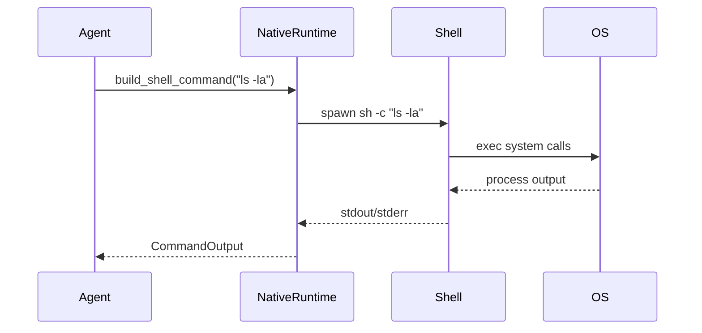
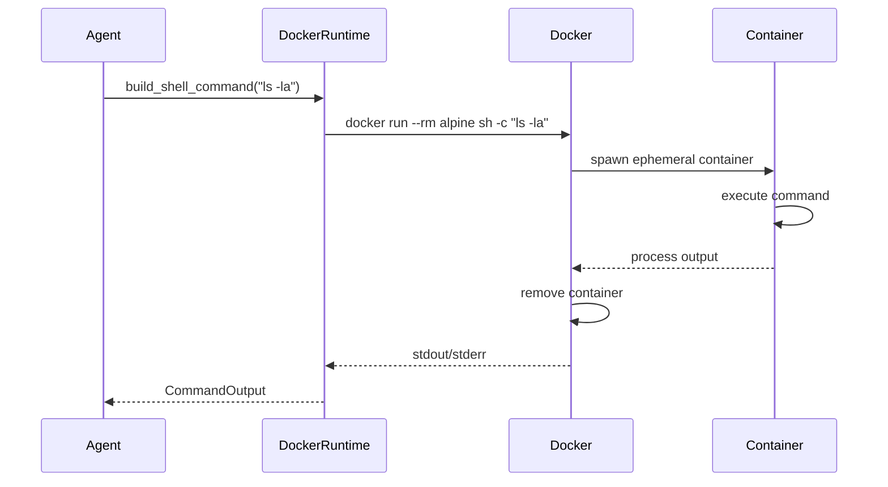

Corvus supports multiple **runtime environments** through the `RuntimeAdapter` trait. Each runtime provides different trade-offs between isolation, performance, and platform compatibility.

## Runtime Types

Corvus currently supports two production runtimes:

<CardGroup cols={2}>
  <Card title="Native Runtime" icon="computer">
    Direct execution on host OS - maximum performance, minimal isolation
  </Card>
  <Card title="Docker Runtime" icon="docker">
    Containerized execution - strong isolation, resource limits
  </Card>
</CardGroup>

### Native Runtime

The **native runtime** executes commands directly on the host operating system with minimal overhead.

**Location:** `clients/agent-runtime/src/runtime/native.rs`

```rust
pub struct NativeRuntime;

impl RuntimeAdapter for NativeRuntime {
    fn name(&self) -> &str {
        "native"
    }

    fn has_shell_access(&self) -> bool {
        true
    }

    fn has_filesystem_access(&self) -> bool {
        true
    }

    fn storage_path(&self) -> PathBuf {
        directories::UserDirs::new().map_or_else(
            || PathBuf::from(".corvus"),
            |u| u.home_dir().join(".corvus"),
        )
    }

    fn supports_long_running(&self) -> bool {
        true
    }

    fn build_shell_command(
        &self,
        command: &str,
        workspace_dir: &Path,
    ) -> anyhow::Result<tokio::process::Command> {
        let mut process = tokio::process::Command::new("sh");
        process.arg("-c").arg(command).current_dir(workspace_dir);
        Ok(process)
    }
}
```

**Use cases:**
- Local development
- Trusted environments
- Performance-critical workloads
- Desktop/CLI applications

**Configuration:**

```toml
[runtime]
kind = "native"
```

**Characteristics:**
- **Startup:** &lt;100ms
- **Memory overhead:** ~20MB
- **Isolation:** Policy-based only
- **Platform:** Linux, macOS, Windows

### Docker Runtime

The **Docker runtime** executes commands in ephemeral containers for strong isolation.

**Location:** `clients/agent-runtime/src/runtime/docker.rs`

```rust
pub struct DockerRuntime {
    config: DockerRuntimeConfig,
}

impl RuntimeAdapter for DockerRuntime {
    fn name(&self) -> &str {
        "docker"
    }

    fn has_shell_access(&self) -> bool {
        true
    }

    fn has_filesystem_access(&self) -> bool {
        self.config.mount_workspace
    }

    fn storage_path(&self) -> PathBuf {
        if self.config.mount_workspace {
            PathBuf::from("/workspace/.corvus")
        } else {
            PathBuf::from("/tmp/.corvus")
        }
    }

    fn supports_long_running(&self) -> bool {
        false  // Each command is a fresh container
    }

    fn memory_budget(&self) -> u64 {
        self.config.memory_limit_mb
            .map_or(0, |mb| mb.saturating_mul(1024 * 1024))
    }

    fn build_shell_command(
        &self,
        command: &str,
        workspace_dir: &Path,
    ) -> anyhow::Result<tokio::process::Command> {
        let mut process = tokio::process::Command::new("docker");
        process
            .arg("run")
            .arg("--rm")
            .arg("--init")
            .arg("--interactive");

        // Network isolation
        if !self.config.network.is_empty() {
            process.arg("--network").arg(&self.config.network);
        }

        // Memory limit
        if let Some(mb) = self.config.memory_limit_mb.filter(|mb| *mb > 0) {
            process.arg("--memory").arg(format!("{mb}m"));
        }

        // CPU limit
        if let Some(cpus) = self.config.cpu_limit.filter(|cpus| *cpus > 0.0) {
            process.arg("--cpus").arg(cpus.to_string());
        }

        // Read-only root filesystem
        if self.config.read_only_rootfs {
            process.arg("--read-only");
        }

        // Workspace mount
        if self.config.mount_workspace {
            let host_workspace = self.validate_workspace(workspace_dir)?;
            process
                .arg("--volume")
                .arg(format!("{}:/workspace:rw", host_workspace.display()))
                .arg("--workdir")
                .arg("/workspace");
        }

        process
            .arg(&self.config.image)
            .arg("sh")
            .arg("-c")
            .arg(command);

        Ok(process)
    }
}
```

**Use cases:**
- Untrusted code execution
- Multi-tenant environments
- Resource-constrained scenarios
- Production deployments

**Configuration:**

```toml
[runtime]
kind = "docker"

[runtime.docker]
image = "alpine:3.20"              # Base container image
network = "none"                   # Network isolation (none | bridge | host)
memory_limit_mb = 512              # Memory limit in MB
cpu_limit = 2.0                    # CPU cores limit
read_only_rootfs = true            # Read-only filesystem
mount_workspace = true             # Mount workspace directory
allowed_workspace_roots = [        # Allowlist for workspace mounts
  "/home/user/projects",
  "/tmp/workspaces"
]
```

**Characteristics:**
- **Startup:** ~2-3s (container creation)
- **Memory overhead:** ~50MB + container overhead
- **Isolation:** Process, network, filesystem
- **Platform:** Linux, macOS, Windows (Docker Desktop)

## Execution Model

### Native Execution Flow



**Isolation layers:**
1. **Security Policy** - Command allowlists, path restrictions
2. **Workspace Scoping** - Filesystem access limited to workspace
3. **Landlock/Firejail** *(optional)* - Kernel-level sandboxing

### Docker Execution Flow



**Isolation layers:**
1. **Container Isolation** - Separate PID, network, mount namespaces
2. **Resource Limits** - Memory, CPU, I/O quotas
3. **Network Isolation** - Configurable network access
4. **Filesystem Isolation** - Read-only rootfs, selective mounts
5. **Security Policy** - Command validation before execution

## Sandboxing Approaches

Corvus provides multiple sandboxing mechanisms depending on the runtime and platform:

### Docker Sandboxing (Recommended)

Docker provides the strongest isolation:

<AccordionGroup>
  <Accordion title="Process Isolation">
    Separate PID namespace prevents process visibility and interaction
  </Accordion>
  <Accordion title="Network Isolation">
    `network=none` blocks all network access
  </Accordion>
  <Accordion title="Filesystem Isolation">
    Read-only root filesystem with selective mounts
  </Accordion>
  <Accordion title="Resource Limits">
    Enforced memory and CPU quotas prevent resource exhaustion
  </Accordion>
  <Accordion title="Capability Dropping">
    Containers run with minimal Linux capabilities
  </Accordion>
</AccordionGroup>

### Linux Kernel Sandboxing

On Linux, native runtime can use kernel-level sandboxing:

**Landlock (Linux 5.13+):**
- Filesystem access control at kernel level
- Zero overhead
- No external dependencies

**Firejail:**
- Userspace sandboxing wrapper
- Namespace isolation
- Seccomp filtering

**Bubblewrap:**
- Lightweight container runtime
- Used by Flatpak

**Detection and selection:**

```rust
pub fn create_sandbox(policy: &SecurityPolicy) -> Box<dyn Sandbox> {
    // Prefer Landlock on modern kernels
    if landlock::is_supported() {
        return Box::new(LandlockSandbox::new(policy));
    }

    // Fall back to Firejail if available
    if firejail::is_available() {
        return Box::new(FirejailSandbox::new(policy));
    }

    // No-op sandbox as last resort
    Box::new(NoopSandbox)
}
```

### Policy-Based Restrictions

All runtimes enforce policy-based restrictions:

```rust
pub struct SecurityPolicy {
    pub autonomy: AutonomyLevel,
    pub workspace_dir: PathBuf,
    pub workspace_only: bool,            // Restrict to workspace
    pub allowed_commands: Vec<String>,    // Command allowlist
    pub forbidden_paths: Vec<String>,     // Path blocklist
    pub max_actions_per_hour: u32,        // Rate limiting
    pub require_approval_for_medium_risk: bool,
    pub block_high_risk_commands: bool,
}
```

See [Security Model](/security-model) for details.

## Performance Characteristics

### Native Runtime

| Metric | Value |
|--------|-------|
| Cold start | &lt;100ms |
| Command execution overhead | &lt;10ms |
| Memory baseline | ~20MB |
| Memory per session | ~50-100MB |
| Throughput | ~100 commands/sec |

### Docker Runtime

| Metric | Value |
|--------|-------|
| Cold start | ~2-3s |
| Command execution overhead | ~200-500ms |
| Memory baseline | ~50MB + image |
| Memory per session | ~100-200MB |
| Throughput | ~5-10 commands/sec |

**Optimization tips:**

<Tip>Use **native runtime** for development and trusted environments</Tip>
<Tip>Use **Docker runtime** for production and untrusted code</Tip>
<Tip>Pre-pull Docker images to reduce first-run latency</Tip>
<Tip>Use Alpine-based images for minimal overhead</Tip>

## Resource Limits

### Memory Limits

**Docker:**
```toml
[runtime.docker]
memory_limit_mb = 512  # Hard limit enforced by Docker
```

**Native:**
No hard limits - relies on OS scheduling

### CPU Limits

**Docker:**
```toml
[runtime.docker]
cpu_limit = 2.0  # Maximum CPU cores
```

**Native:**
No hard limits - full access to available cores

### Timeout Limits

Both runtimes support execution timeouts:

```rust
let output = tokio::time::timeout(
    Duration::from_secs(30),
    cmd.output()
).await??;
```

## Workspace Mounting

### Native Runtime

Direct filesystem access - no mounting needed.

**Security:**
- `workspace_only` policy restricts paths
- `forbidden_paths` blocklist
- Landlock filesystem constraints

### Docker Runtime

Selective mounting with validation:

```rust
fn validate_workspace(&self, workspace_dir: &Path) -> anyhow::Result<PathBuf> {
    let resolved = workspace_dir.canonicalize()?;

    // Refuse to mount system root
    if resolved == Path::new("/") {
        anyhow::bail!("Refusing to mount filesystem root");
    }

    // Check against allowlist
    if !self.config.allowed_workspace_roots.is_empty() {
        let allowed = self.config.allowed_workspace_roots.iter()
            .any(|root| resolved.starts_with(root));

        if !allowed {
            anyhow::bail!("Workspace not in allowed_workspace_roots");
        }
    }

    Ok(resolved)
}
```

**Mount options:**
- `mount_workspace = true` - Mount workspace directory
- `allowed_workspace_roots` - Allowlist specific paths
- Read-write access within container

## Platform Support

| Runtime | Linux | macOS | Windows |
|---------|-------|-------|----------|
| Native | ✅ Full | ✅ Full | ✅ Full |
| Docker | ✅ Full | ✅ Full | ⚠️ Docker Desktop required |
| Landlock | ✅ 5.13+ | ❌ | ❌ |
| Firejail | ✅ | ❌ | ❌ |

## Future Runtimes

<Info>**WASM Runtime** *(planned)* - WebAssembly sandboxing for portable execution</Info>
<Info>**Cloudflare Workers** *(planned)* - Edge runtime support</Info>
<Info>**Kubernetes Runtime** *(planned)* - Cluster-native execution</Info>

## Best Practices

<Check>**Do:**</Check>
- Use Docker runtime for production deployments
- Enable `read_only_rootfs` when possible
- Set memory and CPU limits
- Use network isolation (`network=none`)
- Validate workspace paths before mounting
- Pre-pull container images

<Warning>**Don't:**</Warning>
- Mount system directories (`/etc`, `/root`)
- Run Docker containers with `--privileged`
- Use `network=host` unless necessary
- Mount entire home directory
- Ignore resource limits

## Troubleshooting

### Docker Runtime Issues

**Problem:** "Cannot connect to Docker daemon"
```bash
# Check Docker is running
docker ps

# Start Docker service
sudo systemctl start docker
```

**Problem:** "Permission denied" on workspace mount
```toml
# Add workspace to allowlist
[runtime.docker]
allowed_workspace_roots = ["/path/to/workspace"]
```

**Problem:** Slow container startup
```bash
# Pre-pull the image
docker pull alpine:3.20
```

### Native Runtime Issues

**Problem:** "Command not found"
```toml
# Add command to allowlist
[security]
allowed_commands = ["git", "npm", "cargo", "mycommand"]
```

**Problem:** "Path access denied"
```toml
# Adjust workspace restrictions
[security]
workspace_only = false
forbidden_paths = []  # Be careful with this
```

## Next Steps

<CardGroup cols={2}>
  <Card title="Security Model" icon="shield" href="/security-model">
    Understand security policies and sandboxing
  </Card>
  <Card title="Configuration" icon="gear" href="/configuration/overview">
    Configure runtime settings
  </Card>
  <Card title="Architecture" icon="sitemap" href="/architecture">
    See how runtimes fit into the system
  </Card>
  <Card title="Deployment Guide" icon="rocket" href="/guides/deployment">
    Deploy Corvus to production
  </Card>
</CardGroup>